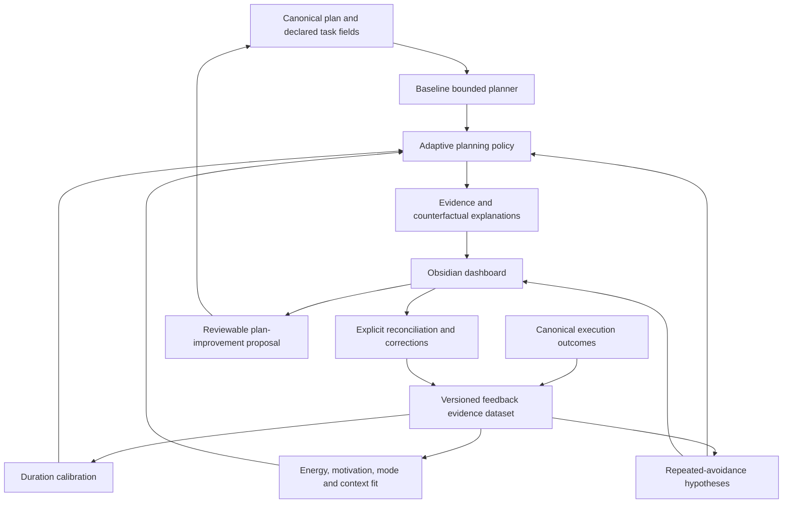

# Adaptive-Planning Feedback Architecture

## Purpose

LifeOS may learn from explicit task outcomes, but it must not turn personal history
into an opaque score or a second source of truth. Canonical plans and execution
records remain Markdown. Adaptive feedback is a disposable, deterministic view.

## Trust boundaries

| State | Authority | Persistence | Examples |
|---|---|---|---|
| Canonical fact | Human-recorded Markdown | Git-tracked | task outcome, actual minutes, correction |
| Derived statistic | Deterministic Python | disposable `.lifeos/` | medians, fit summaries, evidence counts |
| Tentative diagnosis | Deterministic hypothesis | disposable or review artifact | repeated oversizing, unclear next action |
| Agent proposal | Human-review boundary | Git-tracked proposal | decompose task, revise estimate |
| UI state | Obsidian plugin | ephemeral | expanded panel, selected tab |

A statistical result may alter a recommendation only inside bounded policy. It
cannot modify a plan. Consequential changes use the existing proposal lifecycle.

## Versioned vocabulary

Execution observation schema version 1 preserves:

- observation and source event identity
- task, plan, goal, mode and optional task shape
- declared and actual duration
- outcome and explicit completion fraction
- energy and motivation as separate fields
- blockers, reasons and explicit time window
- correction and retraction lineage
- source path, source hash and event date

Derived feedback schema version 1 records the evidence version, policy version,
calculation timestamp or `as_of` date, source hashes, confidence, ignored signals,
and exact evidence references. Derived output is byte-for-byte deterministic for
the same canonical input and `as_of` date.

## Corrections and retractions

A canonical event is never edited out of history by derived code. A later event
may declare `corrects_event_id` or `retracts_event_id`. The evidence builder keeps
lineage, selects the latest valid correction, and reports conflicts. A correction
that cannot be resolved is diagnosed and excluded from adaptive use.

User preferences are canonical in `system/adaptive-planning.yml`. They contain:

- mode: `off`, `shadow`, or `active`
- disabled feedback dimensions
- excluded event IDs
- dismissed diagnosis IDs with evidence fingerprints
- reset marker date and optional reason

A reset discards derived state and ignores evidence before its marker for
adaptation. It does not delete execution history.

## Confidence and fallback

| Evidence level | Minimum usable samples | Typical confidence | Allowed effect |
|---|---:|---|---|
| Exact recurring task | 3 | low to high | bounded duration and rank adjustment |
| Task shape | 4 | low to moderate | bounded duration and fit adjustment |
| Plan | 5 | low to moderate | cautious fallback |
| Mode | 6 | low to moderate | cautious fallback |
| Global | 8 | low | smallest fallback |
| Below threshold | none | insufficient | baseline only |

Confidence also considers freshness, spread, missingness and contradiction. No
result with insufficient or contradictory evidence changes the active menu.
Effects are capped so explicit blockers, due dates, user-selected mode and
available time remain dominant.

## Freshness, decay and outliers

- Evidence is ordered by canonical date and stable event ID.
- Recent observations receive transparent age bands, not hidden model weights.
- Evidence older than the configured horizon is reported as stale and cannot
  independently produce a high-confidence adjustment.
- Robust medians and median absolute deviation limit outlier influence.
- Impossible duration, chronology and correction records are diagnostics, not
  silent exclusions.
- Missing values remain unknown. They are never converted into failure.

## Planner modes

- **Off** returns the baseline planner result and does not build an adaptive menu.
- **Shadow** computes adaptive deltas for inspection but returns the baseline
  selection.
- **Active** returns the bounded adaptive selection together with the complete
  baseline and explanation.

The user can always inspect the original declared estimate, baseline rank,
adaptive rank, evidence count, confidence and counterfactual conditions.

## Privacy and retention

Execution history is private vault content. Feedback processing is local and
restricted to canonical planning scope. Derived records store references and
aggregates, not unrelated journal prose. No telemetry or cross-user learning is
permitted. Deleting `.lifeos/feedback/` removes all derived feedback and leaves
canonical history intact.

## Protocol boundary

The Obsidian plugin calls typed bridge operations for:

- dataset status and rebuild
- adaptive preferences and reset
- baseline, shadow and active planning
- explanation and counterfactual queries
- outcome correction and evidence exclusion
- diagnosis dismissal and proposal preparation

TypeScript renders results but does not calculate feedback or write Markdown
directly.

## Compatibility and migration

Every canonical and derived schema carries a version. Unsupported canonical
versions fail with typed diagnostics. Unsupported derived state is deleted and
rebuilt. Policy upgrades preserve baseline behavior and require replay tests
before becoming the default active policy.

## Implementation sequence

1. Build the evidence dataset.
2. Add duration calibration.
3. Add capacity-fit summaries.
4. Add repeated-avoidance hypotheses.
5. Layer bounded adaptation over the baseline planner.
6. Expose inspectable explanations.
7. Add Obsidian correction and reset controls.
8. Create plan-improvement proposals.
9. Validate through replay, end-to-end tests and user-manual updates.
