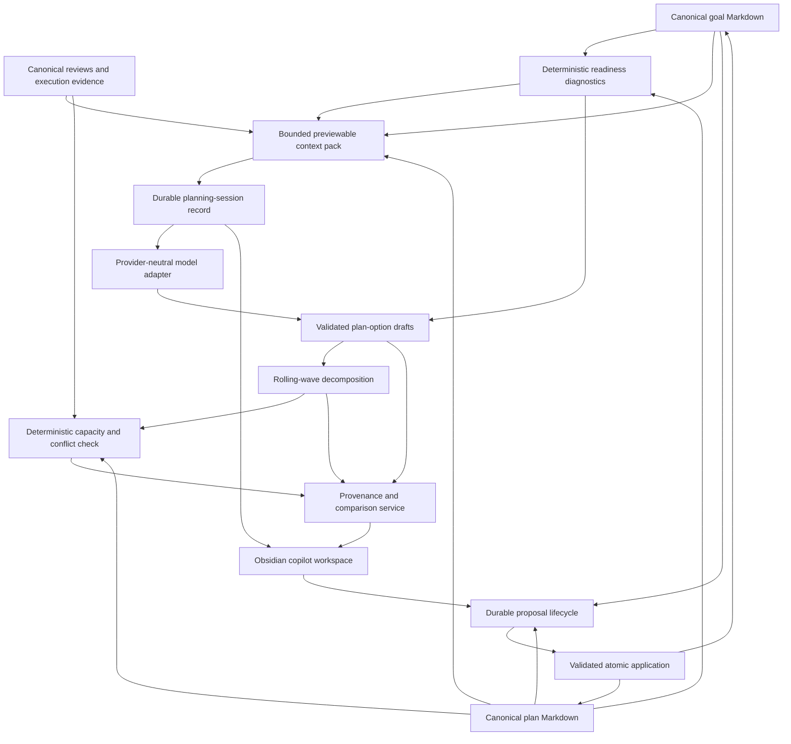

# Goal-to-Plan Copilot Architecture

## Purpose

The goal-to-plan copilot helps a user move from a broad direction to a small,
reviewable planning decision. It is deliberately not an obligation generator.
It may conclude that the right result is clarification, a reversible experiment,
linking an existing plan, parking the goal, pausing, or creating no plan.

## Accepted design decisions

- **Readiness is explicit and deterministic.** Identity, desired change, horizon,
  constraints, contradictions, and existing-plan coverage are checked before any
  model call. Unknown values remain unknown.
- **Options are few and meaningfully different.** A session may return zero to
  three options. Differences must concern strategy, scope, pace, or uncertainty
  posture rather than wording.
- **Planning is rolling-wave.** Distant work remains as outcome-oriented
  milestones. Only the current wave, normally one review interval or at most two
  weeks, becomes concrete actions.
- **Context is minimized and previewable.** Explicit goal links, selected plans,
  relevant review facts, capacity facts, and user-selected notes are included in
  stable order. Sensitive folders require explicit inclusion and redaction is
  applied before model invocation.
- **Canonical changes are proposal-gated.** Conversation, drafts, context packs,
  and model output cannot write goals or plans. The user's final visible draft is
  converted into ordinary typed proposal operations with current base hashes.
- **Daily planning remains deterministic.** The copilot proposes medium-term
  structure. Baseline and adaptive daily planners remain authoritative for the
  daily menu.

## Components and trust boundaries



| Layer | Authority | Persistence | May write canonical Markdown? |
|---|---|---|---|
| Goal, plan, review, execution notes | user-authored canonical state | Git-tracked | user or approved proposal only |
| Readiness, context, fit, explanation | deterministic facts | disposable/rebuildable | no |
| Planning session | visible answers and decisions | durable local JSON | no |
| Model adapter | semantic suggestion | transient | no |
| Plan-option draft | validated suggestion | session-linked draft | no |
| Proposal | review boundary | Git-tracked | only after approval/application |
| Obsidian UI | interaction state | ephemeral | no direct consequential writes |

## Versioned contracts

All contracts use integer `schema_version` fields. Version 1 defines:

```yaml
planning_session:
  schema_version: 1
  session_id: session-20260716-example
  goal_ref: goals/learn-cell-biology.md
  goal_hash: sha256:...
  status: clarifying
  answers:
    - question_id: desired-change
      response_kind: answered
      value: Understand the first six chapters well enough to explain them.
  selected_context_refs: [goals/learn-cell-biology.md]
  excluded_context_refs: []
  decisions: []
  selected_option_id: null
  proposal_ids: []
```

```yaml
plan_option:
  schema_version: 1
  option_id: option-focused-foundation
  title: Focused foundation
  strategy: Complete a bounded first pass with weekly synthesis.
  desired_outcome: Explain the selected chapters and connect major concepts.
  boundaries: [No complete textbook backlog, No one-task-per-flashcard plan]
  assumptions:
    - statement: Four study hours are available each week.
      source_kind: agent_assumption
  success_evidence: [Six chapter synthesis notes, One self-explanation review]
  risks: [The pace may be too dense]
  review_date: 2026-08-13
  milestones:
    - milestone_id: milestone-foundations
      title: Build foundations
      outcome: Chapters 1–3 can be explained from memory with notes as support.
      wave: current
  tradeoffs: [Narrower scope in exchange for faster feedback]
  unresolved_questions: []
  source_refs: [goals/learn-cell-biology.md]
```

Hidden chain of thought is never stored. Sessions preserve only visible questions,
answers, decisions, references, hashes, outcomes, and proposal links.

## Readiness and path decision table

| Condition | Default path | Required user control |
|---|---|---|
| Missing identity or unreadable goal | decline | repair/open source |
| Missing desired change or purpose | clarify | answer, skip, unknown, stop |
| High uncertainty with cheap reversible test | experiment | edit or reject experiment |
| Existing active plan already covers outcome | link existing plan | confirm link or continue clarification |
| Ready, bounded, no blocking contradiction | plan | compare/edit zero to three options |
| Valid direction but deliberately inactive | park | optional review date |
| Active plan conflicts with changed constraint | pause/review | continue unchanged is always available |
| Archived goal | decline by default | explicitly reopen first |
| No viable option | no plan | save session, experiment, park, or abandon |

## Rolling-wave depth

- Current wave: concrete actions that fit one review interval, normally seven to
  fourteen days.
- Next wave: milestones and candidate outcomes only.
- Later waves: coarse milestones without dates or task estimates unless an
  external constraint supplies them.
- Re-decomposition occurs after milestone completion, changed constraints, or a
  scheduled review. It begins from current canonical state.

## Context minimization

The default allowlist is the selected goal, explicitly linked plans, explicit
blockers, current planning preferences, bounded capacity facts, and recent
relevant reviews. Journal, health, finance, relationship, and other sensitive
scopes are denied unless both policy and an explicit user inclusion permit them.
Every item records path, stable ID when present, hash, inclusion reason, byte
count, truncation, redactions, freshness, and omissions.

## Failure modes and recovery

| Failure | Safe behavior | Recovery |
|---|---|---|
| No model configured | deterministic questions and fixtures remain usable | configure adapter or continue without model |
| Invalid or excessive model output | reject output, retain session | retry or use deterministic fallback |
| Source changed after preview | mark context/session stale | rebuild from current source |
| Duplicate plan or ID | block proposal creation | link existing plan or regenerate IDs |
| Bridge/plugin restart | session remains durable | resume by session ID |
| Proposal target changed | application fails stale | rebuild proposal from current canonical state |
| Interrupted application | existing recovery journal governs | run proposal recovery |
| Sensitive scope denied | omit and report denial | explicitly include an allowed source or continue |
| Unsupported schema/protocol | fail closed | migrate supported versions or upgrade components |

## Provider-neutral boundary

Adapters receive a validated request containing the user-visible prompt,
previewed context items, strict output schema, and resource limits. Adapters may
be local, remote, fixture-based, or absent. Repository contracts never require a
provider-specific file, field, environment variable, or instruction format.

## Shipped implementation

Phase 12 is complete:

1. `LIFEOS-1201`: contracts and conservative parsing.
2. `LIFEOS-1202`: readiness diagnostics and bounded context.
3. `LIFEOS-1203`: guided clarification sessions.
4. `LIFEOS-1204`: structured option synthesis.
5. `LIFEOS-1205`: rolling-wave decomposition.
6. `LIFEOS-1206`: portfolio capacity and conflict checks.
7. `LIFEOS-1207`: explanations, provenance, and comparison.
8. `LIFEOS-1208`: safe proposal conversion.
9. `LIFEOS-1209`: Obsidian workspace.
10. `LIFEOS-1210`: reviews and replanning.
11. `LIFEOS-1211`: end-to-end release validation and documentation.

Release fixtures exercise deterministic and adapter-assisted paths, context
privacy, stale and malformed inputs, proposal application and recovery, existing
plan suppression, changed-evidence replanning, schema compatibility, large-vault
budgets, and disposable-state removal. The user workflow is documented in
[User Manual Chapter 9](user-manual/09-goal-to-plan-copilot.md).
