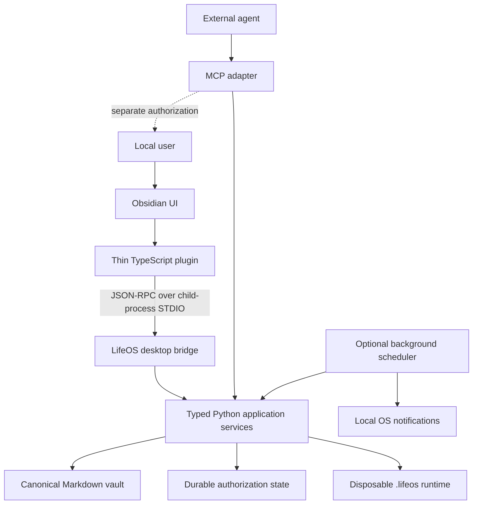

# Obsidian Desktop Architecture

## Decision summary

The supported desktop topology is a thin TypeScript Obsidian plugin that launches one
vault-scoped Python child process and communicates with it using newline-delimited JSON-RPC
2.0 over dedicated STDIO pipes. The Python process owns validation, planning, study,
attention, proposal, recovery, status, and every canonical Markdown mutation.

A separately installed background service is optional and is used only for scheduled
attention checks when Obsidian is closed. It uses the same typed application services and
never becomes a second source of truth.

## Component and trust boundaries



The plugin connection proves only that a local Obsidian instance launched the bridge. It
does not grant external agents approval authority. Approval and application continue to use
trusted interactive authorization in Python.

## Process lifecycle

1. The plugin resolves a configured Python executable and `lifeos-desktop-bridge` command.
2. It acquires a vault-scoped process lock under `.lifeos/desktop/`.
3. It launches the child with the absolute configuration path and an explicit local actor ID.
4. The first request is `system.handshake`.
5. The plugin enables only capabilities returned by the handshake.
6. On crash, pending requests fail as `bridge_unavailable`; the plugin may restart with
   bounded exponential backoff.
7. Normal plugin unload sends `system.shutdown`, waits briefly, then terminates the child.

A second plugin instance discovers the lock owner and connects only when the configured
transport supports it; v1 otherwise fails clearly rather than launching a duplicate writer.
The STDIO reader and dispatcher have deliberately different concurrency roles. Ordinary requests
enter one serialized worker, so canonical mutations never overlap. The reader may handle only the
`request.cancel` control method while that worker is busy. Each string request ID is registered as
queued, active, or recently completed. Cancellation can prevent queued work from starting or set
the existing cooperative retrieval/extraction token for an active cancellable method; it reports
`not-cancellable`, `already-completed`, `already-requested`, or `unknown-request` without claiming
that work was interrupted. Progress notifications and responses share one locked protocol writer,
so complete JSON lines may interleave but cannot corrupt STDOUT framing.

Shutdown and STDIN disconnect signal cancellable active work and drain the serialized worker.
Already-started non-cancellable mutations finish their authorized commit or use their existing
recovery contract; they are never interrupted by a second mutation thread. The plugin's ordinary
Promise-returning `call()` remains compatible, while optional work can retain a correlated handle
whose cancel action targets the exact bridge request ID.

Logs go to `.lifeos/logs/desktop-bridge.log`, never to protocol STDOUT.

## Protocol envelope

Protocol version `1.0` uses one JSON object per UTF-8 line.

Request:

```json
{"jsonrpc":"2.0","id":"req-17","method":"system.health","params":{},"meta":{"protocol":"1.0","idempotency_key":null}}
```

Success:

```json
{"jsonrpc":"2.0","id":"req-17","result":{"status":"healthy","engine_version":"0.0.1"},"meta":{"protocol":"1.0"}}
```

Typed error:

```json
{"jsonrpc":"2.0","id":"req-18","error":{"code":"stale_write","message":"The note changed after it was opened.","data":{"path":"plans/biology.md","remediation":"Reload the note and retry."}},"meta":{"protocol":"1.0"}}
```

Notification:

```json
{"jsonrpc":"2.0","method":"attention.changed","params":{"revision":"sha256:..."},"meta":{"protocol":"1.0"}}
```

Unknown methods, unknown fields, incompatible major versions, and malformed envelopes are
rejected. Minor versions negotiate a capability list. Retryable mutations require an
idempotency key. Read requests may be retried; writes may only be retried with the same key.

## Semantic capability discovery

The handshake capability list remains protocol negotiation: it is an ordered list of supported
low-level bridge method names. It does not become a user-facing feature catalog. The additive,
read-only methods `capability.list` and `capability.get` expose a separate versioned semantic
catalog owned by Python. `capability.list` accepts no parameters; `capability.get` requires a
stable `capability_id` and returns `capability_not_found` for an unknown ID.

Semantic capability responses carry `semantic_capability_schema` plus rich metadata such as the
stable capability ID, name, description, human-facing category, visibility, maturity, static
requirements, concrete backing references, direct entry points, and optional example prompts.
Entries are returned in stable ID order. These calls read static application metadata only and do
not touch canonical Markdown or derived vault state.

The `lifeos-explore` Obsidian view is a thin consumer of that Python-owned metadata, not another
authority. Its controller validates the versioned response shape at runtime, drops entries whose
visibility is not `explore`, and performs search, category grouping, selection, and detail
presentation locally over the returned payload. TypeScript does not maintain a parallel hard-coded
feature list or infer capabilities from commands, prompts, bridge namespaces, or function names.
Malformed or unsupported semantic payloads fail into an explicit recoverable state instead of being
partially rendered.

Explore entry points preserve the existing execution boundary. Declared `obsidian_view` targets
are opened through the plugin's normal view host and declared `obsidian_command` targets are sent
through Obsidian's existing command dispatcher. CLI, MCP-tool, and workflow entry points are shown
as references rather than reimplemented. Example prompts are clipboard-only teaching metadata and
are never auto-submitted. Browsing the catalog, filtering it, opening details, or copying a prompt
therefore remains read-only with respect to canonical Markdown.

## State ownership

| State | Authority | Examples |
|---|---|---|
| Canonical Markdown | Git-tracked vault | plans, journal, reviews, proposals |
| Durable authorization | Git-tracked system files | generated ownership, approved proposal state |
| Derived runtime | `.lifeos/` | registry, graph, exports, attention cache |
| Ephemeral UI | Obsidian workspace storage | panel selection, open modal, draft form values |

Disabling or uninstalling the plugin leaves the vault readable and editable. Deleting
runtime state may require rebuilding but cannot erase canonical knowledge.

## Write and concurrency model

Every update to an existing note includes the content hash observed by the plugin. Python
re-reads the target through secure vault traversal and rejects a mismatch as `stale_write`.
Writes are atomic. Multi-file consequential changes remain proposals and use the existing
recovery journal. Ordinary direct human actions are narrowly targeted mutations that
preserve unrelated frontmatter and body text.

An incomplete recovery journal verifies canonical files against its recorded phase and
fails closed on any mismatch. A structurally valid `complete` journal is already terminal:
the next application removes it without comparing canonical content that the user may have
legitimately changed after the earlier commit. Durable generated ownership remains a
separate application-time preflight check and is never repaired from disposable recovery
state.

The proposal workspace exposes one **Accept changes** action for draft, pending, and
approved proposals. Its single interactive confirmation is bound to the exact review
digest. Python executes only the remaining submit, approve, and apply transitions,
reloading the canonical proposal and checking the digest between them. Application still
runs target-hash, ownership, preflight, and recovery checks. If a later transition fails,
the proposal remains at the last durable lifecycle state rather than pretending the whole
sequence succeeded.

For new proposals, the red/green operation view comes from the canonical,
digest-bound `review.json` created before draft publication. Applied proposals
therefore retain the same reviewed diff even when a target is replaced, moved,
deleted, or an ownership entry is released. `patches.json` remains authoritative
for application. Proposals created before this format use an explicitly labeled
legacy live preview; later vault state may make that reconstruction unavailable.

## Failure modes

| Condition | UI state | Behavior |
|---|---|---|
| Python missing | unavailable | Setup view shows executable guidance; vault remains editable |
| Bridge crash | unavailable | Pending calls fail; safe bounded restart is offered |
| Request implementation failure | error | One redacted typed error is returned; the bridge stays available for later requests |
| Stale file | stale | Action is not applied; reload and compare are offered |
| Blocked recovery | blocked | Canonical writes disabled; recovery details remain visible |
| Protocol mismatch | unsupported | No partial operation; compatible versions are shown |
| Authorization denied | blocked | Consequential action remains unchanged |
| Corrupt source | corrupt | Exact typed diagnostic and source link are shown |

## Repository layout

```text
src/lifeos/daily/             typed daily services
src/lifeos/bridge/            JSON-RPC envelopes, dispatcher, stdio server
src/lifeos/attention/         deterministic attention rules
src/lifeos/reviews/           review-note services
src/lifeos/scheduler/         optional background scheduler
packages/obsidian-plugin/     thin TypeScript plugin
packages/obsidian-plugin/src/views/
packages/obsidian-plugin/src/client/
tests/daily/ tests/bridge/ tests/attention/ tests/reviews/
```

## Desktop and mobile

Desktop is fully supported. Mobile v1 is intentionally reduced to ordinary Markdown editing
and optional capture templates. It does not run the Python engine, approve proposals, or
promise background attention processing.

## Sequenced implementation

`LIFEOS-1001` establishes typed writes, `1002` exposes them through the bridge, `1003`
creates the plugin shell, `1004` through `1010` add user workflows, `1011` adds optional
background delivery, and `1012` validates and packages the complete desktop loop.

## Semantic retrieval workspace

The knowledge conversation workspace follows the same thin-client boundary. The
plugin owns presentation and ephemeral selection state; Python owns scope policy,
index lifecycle, retrieval, citation validation, conversation artifacts, and
proposal construction. The primary view presents scope, privacy disclosure,
index health, ranked evidence, grounded answer paragraphs, and source controls in
one inspectable workflow.

The bridge capability family includes `retrieval.index.health`, rebuild,
synchronize, recovery plan, recover, and search, plus conversation create, list,
load, ask, scope update, pin, exclude, branch, rename, archive, stale check, and
proposal preview/create. Index progress uses JSON-RPC notifications. Strict
parameter allowlists and protocol negotiation reject unknown fields or unsupported
major versions.

Conversation Markdown belongs to canonical state. `.lifeos/retrieval/` belongs
to derived runtime. Protected scope checks occur in Python before candidate
selection and before provider disclosure. Missing providers degrade to local
retrieval; corrupt or incompatible index state disables unsupported operations and
offers an explicit derived-state rebuild.

Additional repository paths:

```text
src/lifeos/retrieval/                 structural index and hybrid retrieval
src/lifeos/conversations/             canonical artifacts, grounding, proposals
packages/obsidian-plugin/src/knowledge-conversation.ts
packages/obsidian-plugin/src/knowledge-conversation-workspace.ts
tests/retrieval/ tests/conversations/ tests/e2e/test_semantic_retrieval_conversations.py
```

## Personal experiment workspace

The experiment workspace is opened from the ribbon, command palette, and relevant
artifact contexts. It is a thin client over typed `experiment.*` bridge methods and
contains design, tracking, analysis, history, proposal, migration, and recovery
surfaces. The plugin never reimplements lifecycle, safety, missing-data, analysis,
or proposal rules.

The controller exposes explicit loading, empty, no-active-experiment, malformed,
stale, unsupported-schema, missing-index, rebuild, provider-unavailable,
provider-timeout, unsafe-blocked, insufficient-evidence, conflicting-edit,
proposal-created, proposal-stale, and migration-required states. Controls have
accessible names, predictable focus restoration, keyboard activation, and live
status announcements. Raw observations and textual summaries remain usable when
visual rendering fails.

## Rich capture workspace

The rich-capture ribbon opens quick capture by default. The workspace controller
also supports review, timeline, gallery, list, meal, exercise, attachment,
unresolved, failed, and archived modes. It saves canonical Markdown before
starting optional processing and routes every domain action through typed
`capture.*` bridge calls.

The controller exposes explicit states for duplicates, unsupported and oversized
processing, missing or changed originals, malformed and unsupported schemas,
queued or interrupted processing, provider failure, sensitive-scope denial,
stale indexes and proposals, merge conflicts, migration, and recovery. Mobile
state uses one column, 44-pixel minimum touch targets, and deferred enrichment.
Keyboard actions have descriptive accessible labels, status changes use live
announcements, and list/raw-record access remains available if visual rendering
fails.