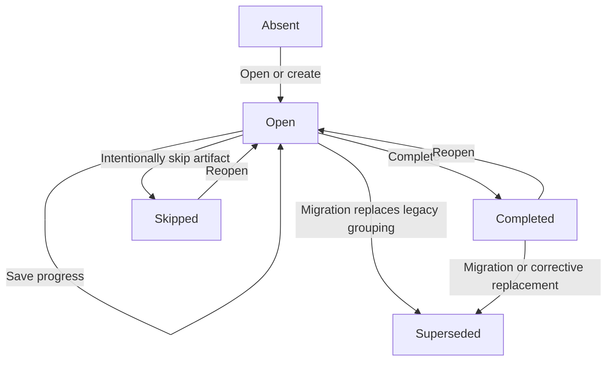
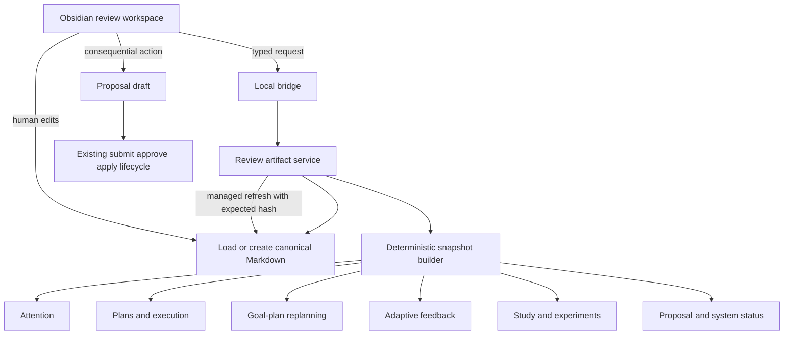

# First-Class Review Artifact Architecture

## Status

Accepted for Phase 13 (`LIFEOS-1300`).

## Purpose

Daily and weekly reviews are no longer treated as a wizard that happens to emit a
note. The Markdown review note is the durable product. The plugin is a workspace
for opening, editing, resuming, refreshing, completing, and revisiting that
artifact.

This design upgrades the existing Phase 10 review workflow rather than replacing
it. Existing deterministic section builders, attention evidence, goal-plan
replanning, adaptive feedback, study review planning, proposals, and optimistic
concurrency remain the foundation.

## User outcome

A user can:

1. open today's daily review or the current weekly review in Obsidian;
2. see deterministic facts with source links and refresh timestamps;
3. write and edit reflection in ordinary Markdown;
4. mark phases, sections, and items as reviewed, skipped, carried, or reopened;
5. close Obsidian and resume later without relying on `.lifeos/` state;
6. revisit previous reviews and follow continuity links;
7. create proposals for consequential changes without the review silently
   rewriting goals, plans, tasks, experiments, or other canonical notes.

## Existing capability audit

| Existing capability | Keep | Change |
|---|---:|---|
| `build_review_workflow` deterministic section gathering | Yes | Refactor behind typed snapshot contracts. |
| Runtime JSON progress under `.lifeos/reviews/` | Cache only | Canonical progress moves into Markdown. |
| `reviews/morning-*.md` and `reviews/evening-*.md` | Migrate | Merge into one daily artifact. |
| `reviews/weekly-*.md` | Migrate | Move to `reviews/weekly/` with stable identity. |
| Managed facts block | Yes | Add schema, snapshot identity, provenance, and refresh history. |
| Human reflection section | Yes | Expand to phase and weekly reflection regions. |
| Attention and review section inputs | Yes | Store source hashes and evidence fingerprints. |
| Goal-plan replanning review | Yes | Link from review items and route changes through proposals. |
| Proposal lifecycle | Yes | Reuse without a parallel review-specific mutation engine. |
| Thin TypeScript review controller | Replace | Introduce an artifact workspace and history browser. |

## Canonical layout

```text
reviews/
├── daily/
│   └── 2026-07-16.md
└── weekly/
    └── 2026-W29.md
```

Legacy files remain readable and are migrated conservatively:

```text
reviews/morning-2026-07-16.md
reviews/evening-2026-07-16.md
reviews/weekly-2026-W29.md
```

## Artifact identity

### Daily

- `review_id`: `daily-YYYY-MM-DD`
- `review_kind`: `daily`
- `period_start`: local calendar date
- `period_end`: same date
- phases: `morning`, `evening`

### Weekly

- `review_id`: `weekly-YYYY-Www`
- `review_kind`: `weekly`
- `period_start`: Monday of the ISO week
- `period_end`: Sunday of the ISO week
- phase: `weekly`

The identity is derived from kind and period and must match the file path. A
second artifact with the same identity is a conflict, not a new version.

## Lifecycle



Allowed statuses are:

- `open`
- `completed`
- `skipped`
- `superseded`

Completion is not a score. Required phases and sections can be completed or
intentionally skipped. Optional sections never block completion.

## Ownership model

| Data | Authority | Storage |
|---|---|---|
| Review identity, status, period, progress, decisions | Canonical | Review frontmatter |
| Deterministic facts and item snapshots | Rebuildable managed content | Managed Markdown blocks |
| Reflection, themes, answers, notes | Human-owned canonical content | Human Markdown regions |
| External source changes | Proposal-gated canonical mutation | Existing proposal system |
| Workspace focus, filters, temporary drafts | Disposable | Plugin memory or `.lifeos/reviews/` cache |
| Review history index | Rebuildable | Runtime index, never sole authority |

## Managed and human-owned regions

A review artifact uses named managed blocks. Regeneration may replace only these
blocks:

- `facts`
- `items`
- `continuity`
- `completion-summary`

Human-owned headings and text are never regenerated:

- `Morning reflection`
- `Evening reflection`
- `Weekly reflection`
- `Themes and observations`
- `Next orientation`
- free-form notes under user-created headings

A missing or duplicated managed boundary fails closed. External edits require an
updated content hash before any canonical write.

## Data flow



## Review artifact contract

The versioned contract contains:

- schema version;
- identity, kind, period, timezone, status, created and updated timestamps;
- phase state and current focus;
- section state and optionality;
- item snapshots with stable IDs, source paths, source hashes, evidence
  fingerprints, and diagnostics;
- item decisions scoped to a snapshot fingerprint;
- structured answers and prompt IDs;
- proposal references;
- previous and next review references;
- migration lineage;
- snapshot hash, generated time, and refresh history.

No field stores hidden model reasoning.

## Snapshot rules

1. Inputs are deterministic and bounded.
2. Each item exposes its source and source hash when available.
3. One failed subsystem marks only its section unavailable.
4. Missing data remains unknown.
5. Refresh compares item fingerprints so prior decisions are not applied to
   materially changed evidence.
6. A stale source never causes silent deletion from history.
7. Managed facts are useful without a model.

## Durable progress

Progress is canonical in frontmatter. It includes:

- active phase and section;
- completed and skipped phases;
- completed and skipped sections;
- item decisions;
- structured answers;
- completion and reopen timestamps.

The runtime cache may mirror this state for faster loading, but deleting the
cache must not lose progress.

## Item decisions

Review-scoped decisions are direct edits to the review artifact:

- `acknowledge`
- `carry`
- `defer_review`
- `clarify`
- `dismiss_for_review`
- `open_source`
- `propose_change`

Only `propose_change` may create an external change draft, and that draft enters
the ordinary proposal lifecycle. Completing a review never marks a task done,
archives a capture, pauses a goal, or rewrites a plan by itself.

## Continuity and carry-forward

Daily reviews link to the previous available daily review. Weekly reviews link
to the previous ISO-week review. Continuity shows:

- prior incomplete phases;
- explicitly carried items;
- unresolved proposals;
- changed evidence for previously dismissed or deferred items;
- prior human-authored orientation.

Carry-forward is explicit. An unresolved item is not automatically copied forever.
An unchanged `dismiss_for_review` decision remains suppressed until its evidence
fingerprint changes.

## Daily artifact behavior

One daily artifact contains both morning and evening phases. The morning phase
orients the day; the evening phase reconciles what happened. A user may:

- complete both;
- intentionally skip either phase;
- open only the evening phase;
- reopen a completed phase;
- refresh facts during the day without losing reflection.

Check-ins and task outcomes remain their own canonical evidence. The daily review
links to them rather than duplicating their authority.

## Weekly artifact behavior

The weekly artifact synthesizes the ISO week and includes bounded sections for:

- execution and unfinished loops;
- goals and plans requiring review;
- adaptive feedback;
- study load;
- inbox and captures;
- experiments and observations;
- proposals;
- system health;
- human-authored themes and next orientation.

Generated evidence may prompt reflection but cannot assert psychological truths.

## Obsidian workspace

The review workspace provides:

- open today's daily artifact;
- open current weekly artifact;
- open active review note;
- resume current phase and section;
- refresh managed facts;
- review source links and diagnostics;
- record item decisions;
- create a proposal draft where supported;
- complete, skip, or reopen a phase or artifact;
- browse review history and continuity;
- recover from stale, malformed, unsupported, or degraded states.

Python remains the sole business-rule engine. TypeScript owns presentation,
focus, and explicit user intent only.

## Migration

Migration is previewed and conservative:

1. detect legacy review files;
2. group morning and evening notes by date;
3. validate managed blocks and collect human reflection;
4. build a target daily or weekly artifact;
5. show collisions and unsupported content;
6. create a proposal or explicit local migration transaction;
7. preserve legacy files until the target is durably written;
8. record `migrated_from` and mark or archive originals only through explicit
   action.

When two legacy notes contain conflicting metadata or duplicate human headings,
the migration reports the conflict instead of guessing.

## Failure modes

| Failure | Behavior |
|---|---|
| Review source changed during save | Reject with stale-write remediation. |
| Managed block missing or duplicated | Fail closed and preserve bytes. |
| Snapshot subsystem fails | Mark one section unavailable. |
| Runtime cache is corrupt or deleted | Rebuild from Markdown. |
| Duplicate review identity | Report conflict and refuse creation. |
| Unsupported schema version | Open read-only with migration guidance. |
| Proposal application interrupted | Use existing recovery journal. |
| Model absent, invalid, or timed out | Deterministic review remains fully usable. |
| Legacy morning/evening merge is ambiguous | Preview conflict and preserve originals. |

## Security and privacy

- Vault-relative paths are validated and symlinks are rejected at write time.
- Existing-note updates require observed hashes.
- Review artifacts do not widen model context permissions.
- Sensitive material is never sent to a model merely because it appears in a
  review.
- Provider-specific files and contracts are unnecessary.

## Removal and portability

Removing the plugin or deleting `.lifeos/` leaves valid Markdown review
artifacts. Managed comments are inert. Review history, reflection, decisions,
proposal references, and continuity remain readable. Reinstalling LifeOS rebuilds
indexes and workspace state from the artifacts.

## Sequenced implementation

| Task | Deliverable |
|---|---|
| `LIFEOS-1301` | Versioned contracts and parity |
| `LIFEOS-1302` | Canonical artifact store |
| `LIFEOS-1303` | Deterministic snapshots and provenance |
| `LIFEOS-1304` | Durable progress and reflection |
| `LIFEOS-1305` | Item decisions and proposal handoff |
| `LIFEOS-1306` | Continuity and carry-forward |
| `LIFEOS-1307` | Daily artifact behavior |
| `LIFEOS-1308` | Weekly artifact behavior |
| `LIFEOS-1309` | Obsidian workspace and history |
| `LIFEOS-1310` | Migration and rebuild |
| `LIFEOS-1311` | End-to-end release and manual |
