[← Manual home](README.md) · [Next: Executive Summary & Philosophy →](02-executive-summary-and-philosophy.md)

# 1. System Architecture Diagram

```mermaid
graph TD
    User["Human user"]
    Obsidian["Obsidian or Markdown editor"]
    CLI["LifeOS CLI"]
    Agent["External AI agent or MCP client"]

    subgraph Canonical["Canonical Git-tracked state"]
        Vault["Markdown vault"]
        Journal["journal and raw"]
        Knowledge["wiki and study"]
        Plans["goals and plans"]
        Cards["flashcards"]
        Patterns["metrics, patterns, reviews"]
        Captures["rich capture Markdown and manifests"]
        Originals["original attachment bytes"]
        Proposals["proposals"]
        Ownership["system/generated-ownership.json"]
        Instructions["system/instructions.yml"]
    end

    subgraph Deterministic["Deterministic LifeOS layer"]
        Config["Configuration loader"]
        SecureVault["Secure vault traversal"]
        Parser["Markdown parser and structural diagnostics"]
        Scanner["Scanner and hashing"]
        Registry["Disposable SQLite registry"]
        Status["Typed status diagnostics"]
        Context["Search and context packs"]
        Study["Study workload planner"]
        Planning["Adaptive daily planner"]
        Observation["Personal-pattern analysis"]
        CaptureEngine["Rich capture, hashing, extraction, and recovery"]
        Graph["Graph view builder"]
        Exports["Export builder"]
    end

    subgraph AgentLayer["Agent-assisted layer"]
        Ingestion["AI ingestion and analysis"]
        Facade["Typed tool facade"]
        MCP["Local STDIO MCP server"]
    end

    subgraph Safety["Consequential-change safety"]
        ProposalEngine["Proposal lifecycle"]
        Approval["Human authorization"]
        Application["Validated application"]
        Recovery["Recovery journal and rollback"]
    end

    subgraph Runtime["Disposable runtime state under .lifeos"]
        RegistryDB["registry.db"]
        RecoveryState["recovery transactions"]
        GraphState["graph generations"]
        ExportState["export generations"]
        CaptureState["capture jobs, extraction, indexes, and views"]
    end

    User --> Obsidian
    Obsidian --> Vault
    User --> CLI
    Agent --> MCP

    CLI --> Config
    MCP --> Facade
    Facade --> SecureVault
    Facade --> ProposalEngine

    Vault --> Journal
    Vault --> Knowledge
    Vault --> Plans
    Vault --> Cards
    Vault --> Patterns
    Vault --> Captures
    Vault --> Originals
    Vault --> Proposals
    Vault --> Ownership
    Vault --> Instructions

    Vault --> SecureVault
    SecureVault --> Parser
    Parser --> Scanner
    Scanner --> Registry
    Registry --> RegistryDB

    Knowledge --> Context
    Instructions --> Context
    Cards --> Study
    Plans --> Planning
    Journal --> Observation
    Patterns --> Observation
    Captures --> CaptureEngine
    Originals --> CaptureEngine
    CaptureEngine --> CaptureState
    CaptureEngine --> ProposalEngine

    Vault --> Graph
    Vault --> Exports
    Graph --> GraphState
    Exports --> ExportState

    CLI --> Status
    RegistryDB --> Status
    RecoveryState --> Status
    GraphState --> Status
    ExportState --> Status

    CLI --> Ingestion
    Ingestion --> ProposalEngine
    ProposalEngine --> Approval
    Approval --> Application
    Application --> Vault
    Application --> Ownership
    Application --> Recovery
    Recovery --> RecoveryState
```

## Architectural reading guide

The diagram separates LifeOS into five responsibility zones:

1. **Canonical state** is the Markdown vault and a small number of explicitly
   versioned authorization or policy files.
2. **Deterministic modules** establish facts, validate structure, build indexes,
   and create reproducible views.
3. **Agent-assisted modules** interpret meaning and propose changes, but do not
   silently rewrite canonical material.
4. **Safety modules** require explicit authorization and apply consequential
   changes through a recoverable state machine.
5. **Runtime state** lives under `.lifeos/` and can be rebuilt from canonical
   files. Rich-capture extraction results, processing jobs, indexes, galleries,
   and chart models belong here, while capture Markdown, manifests, and original
   bytes remain canonical.

The most important rule is that arrows flowing *from* an AI or derived view do
not grant authority. AI output becomes durable only through the proposal,
approval, validation, and application path.

---

[← Manual home](README.md) · [Next: Executive Summary & Philosophy →](02-executive-summary-and-philosophy.md)
