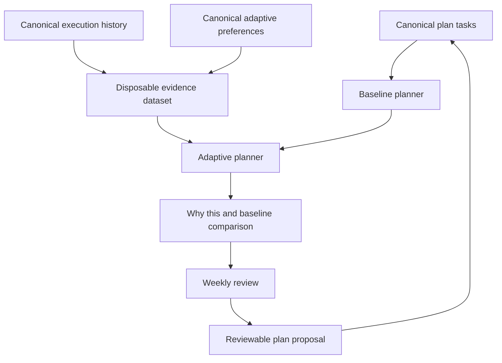

[← Troubleshooting](07-troubleshooting.md) · [Manual home](README.md)

# Adaptive Planning and Feedback

Adaptive planning helps LifeOS compare declared plans with explicit execution history. It can
calibrate time estimates, surface possible task-fit problems, and ask review questions about
repeated avoidance. It remains optional, bounded, explainable, and reversible.

> Adaptive feedback is advice from recorded evidence. It is not a measure of discipline,
> character, health, happiness, or personal worth.

## Architecture and privacy boundary



Canonical information remains in Markdown:

- task definitions inside `plans/`;
- execution outcomes and later corrections inside plan `execution_history`;
- user preferences in `system/adaptive-planning.yml`;
- approved plan changes in the existing proposal lifecycle.

Disposable information remains under `.lifeos/feedback/`:

- normalized evidence caches;
- duration forecasts;
- capacity-fit summaries;
- avoidance diagnoses;
- historical replay results;
- idempotency and UI runtime state.

Deleting `.lifeos/feedback/` removes derived analysis, not your plans or execution history.
LifeOS rebuilds the evidence when the dashboard is refreshed.

## The three modes

Open **LifeOS → Adaptive Planning** and choose one mode.

### Off

The original bounded planner selects the menu. LifeOS may still retain canonical outcomes,
but adaptive evidence does not change the menu.

Use **Off** when:

- you are starting with an empty history;
- you want the original planner only;
- you are troubleshooting;
- you want to keep recording outcomes without using them yet.

### Shadow

LifeOS computes both menus but returns the baseline menu. The dashboard shows what adaptive
planning would have changed.

Use **Shadow** to inspect:

- calibrated versus declared duration;
- selected and deferred differences;
- confidence and evidence counts;
- ignored or disabled signals;
- counterfactual explanations.

Shadow mode is the safest starting point after you have several explicit outcomes.

### Active

LifeOS may return the adaptive menu, subject to the same available-time, blocker, capacity,
and bounded-selection rules. The baseline remains visible beside it.

Active mode never:

- edits a plan automatically;
- marks silence as failure;
- merges energy and motivation into one hidden score;
- applies a plan-improvement proposal without review;
- creates a universal productivity score.

## What counts as evidence

LifeOS prefers explicit events:

- **Done**;
- **Partial** with a completion fraction when known;
- **Skipped** with an optional reason;
- **Deferred**;
- **Cancelled**;
- **Unaccounted** when a planned outcome remains unknown;
- corrected or retracted events.

Missing values remain unknown. A missing outcome is not converted to zero completion. A
missing energy value does not become low energy. A skipped task does not prove low motivation.

## Reading “Why this?”

On a Today task, choose **Why this?**. The explanation separates:

1. **Baseline reason:** urgency, capacity, available time, blockers, and plan diversity.
2. **Duration evidence:** declared and cautious calibrated estimates.
3. **Capacity evidence:** energy, motivation, mode, duration band, time window, and blockers.
4. **Avoidance questions:** tentative hypotheses based on repeated explicit outcomes.
5. **Ignored evidence:** stale, missing, excluded, contradictory, or insufficient records.
6. **Counterfactuals:** conditions under which the recommendation could change.

Example:

```text
Selected in both menus.
Declared duration: 30 minutes.
Adaptive duration: 45 minutes from four explicit completed sessions.
Energy evidence: insufficient, no adjustment.
Motivation evidence: disabled by user.
Counterfactual: with only 35 minutes available, this task would be deferred.
```

Choose **Show Baseline** at any time to compare the adaptive result with the original menu.

## Correcting an outcome

A correction does not erase history. It appends a canonical correction event linked to the
original event.

1. Open the task’s **Execution History**.
2. Select the event.
3. Choose **Correct Outcome**.
4. Change the outcome, actual minutes, completion fraction, or reason.
5. Review the linked original event.
6. Choose **Save Correction**.

The next rebuild resolves the correction lineage deterministically. The original record
remains available for audit, while the corrected interpretation becomes the active evidence.

## Excluding evidence

Use exclusion when an event is accurate but not representative, for example:

- a timer included a long interruption;
- illness made the day incomparable;
- the task ID referred to substantially different work;
- an unusual external deadline distorted the session.

1. Open **Why this? → Evidence**.
2. Select the event.
3. Choose **Exclude from Adaptation**.
4. Optionally record a human reason in the related review note.

The event remains canonical and visible. Only its use in adaptive calculations changes.
Choose **Include Again** to restore it.

## Disabling a signal

Open **Adaptive Planning → Signals** to disable one or more dimensions:

- duration;
- energy;
- motivation;
- mode;
- duration band;
- time window;
- blocker association;
- avoidance diagnosis.

A disabled signal is shown as disabled, not missing or contradictory. Other dimensions remain
independent. Disabling motivation does not disable energy.

## Repeated-avoidance diagnoses

When a task has several adverse or unknown outcomes, LifeOS may ask a tentative question such
as:

- Is the next action underspecified?
- Is the task larger than the available windows?
- Is a recurring blocker unresolved?
- Is the duration estimate consistently too small?
- Does the task fit a different energy or motivation window?
- Is the tracking routine itself too demanding?
- Should the plan or goal be reviewed?

Each card shows explicit event IDs, dates, competing explanations, missing evidence, and
confidence. Choose:

- **Clarify**;
- **Break Down**;
- **Change Estimate**;
- **Add or Resolve Blocker**;
- **Pause Plan**;
- **Open Goal Review**;
- **Reduce Tracking**;
- **Dismiss**.

Dismissal is tied to the exact evidence fingerprint. The unchanged diagnosis stays hidden,
but materially new evidence may produce a new review question.

## Plan-improvement proposals

Adaptive findings cannot rewrite a plan. Choose **Create Proposal** to generate a draft under
`proposals/`.

Every feedback proposal includes:

- the exact target plan and base hash;
- explicit evidence event IDs;
- confidence;
- expected effect;
- alternatives, including taking no action;
- a typed patch;
- a feedback evidence fingerprint.

Review it in **LifeOS → Proposals**, then separately **Submit**, **Approve**, and **Apply**.
Concurrent plan edits make the proposal stale. Interrupted application uses the existing
recovery journal and resumes or rolls back safely.

Agent-assisted decomposition is available only after an explicit user request. It is bounded
to a small number of immediate actions and remains a proposal.

## Resetting after a routine change

A reset creates a canonical evidence boundary. It does not delete earlier history.

1. Open **Adaptive Planning → Reset**.
2. Choose the date from which the new routine should count.
3. Record a reason, such as a schedule change, relocation, illness recovery, or new work mode.
4. Confirm **Set Reset Boundary**.

Events before the boundary remain visible but are excluded from future adaptation. You may
also choose **Rebuild Derived Feedback** to delete disposable caches and rebuild them.

## Historical replay

Open **Adaptive Planning → Historical Replay** to compare baseline and adaptive menus across
selected dates. Replay is read-only and does not publish a new plan.

The report keeps measures separate:

- capacity overflow;
- unused time;
- explicit versus missing outcomes;
- completion fraction when recorded;
- mean absolute estimate error;
- explanation coverage;
- changed task IDs.

There is deliberately no combined “productivity score.” Replay uses only evidence available
before each historical planning day, preventing the same day’s outcome from leaking into its
morning recommendation.

## Daily workflow with adaptive planning

### Morning

1. Open **Today**.
2. Record energy, motivation, and available time.
3. Review the returned menu.
4. In Shadow or Active mode, inspect any meaningful adaptive difference.
5. Use **Why this?** when the recommendation is surprising.
6. Choose your actions. The menu remains a proposal, not an order.

### During the day

1. Use **Start**, **Done**, **Partial**, **Skip**, **Defer**, or **Cancel** when convenient.
2. Record actual time only when reasonably known.
3. Add a brief reason when it will help later interpretation.
4. Let unresolved items become **Unaccounted** rather than inventing an outcome.

### Evening

1. Reconcile unaccounted outcomes.
2. Correct accidental or incomplete records.
3. Inspect attention cards without assuming silence means failure.
4. Complete the evening check-in or reduce its frequency when it does not fit your routine.

## Weekly workflow with adaptive planning

The weekly review includes an **Adaptive Planning Feedback** section. Review:

- systematic duration error;
- repeatedly avoided, partial, or unaccounted tasks;
- plans with no unblocked next action;
- recurring blockers;
- routines that are repeatedly dismissed;
- stalled plans or goals;
- pending feedback proposals.

Promote only durable findings into proposals. A useful weekly review can also conclude that
nothing should change.

## Troubleshooting

### The adaptive menu looks wrong

1. Choose **Show Baseline**.
2. Open **Why this?** and inspect evidence counts.
3. Correct mistaken outcomes.
4. Exclude unusual events.
5. Disable a questionable signal.
6. Switch to **Shadow** or **Off**.
7. Rebuild derived feedback.

### Preferences use an older schema

LifeOS performs an explicit migration preview. Legacy enabled feedback migrates to **Shadow**,
not Active, as the safer default. Unsupported future schemas fail closed without rewriting the
file.

### The cache is missing or corrupt

Choose **Rebuild Derived Feedback**. Canonical plans, outcomes, corrections, preferences, and
proposals remain intact.

### A proposal application was interrupted

Open **System Health → Recovery**. Do not manually delete the transaction directory. LifeOS
uses the recovery journal to finish or restore the transaction before another application.

## Limitations

Adaptive planning learns only from what is explicitly recorded. Its evidence may be sparse,
biased, inconsistent, or affected by unrecorded circumstances. It does not establish causal
relationships. It cannot know whether a physical-world task happened when no outcome was
recorded, though the attention engine can notice the missing page and ask.

[← Troubleshooting](07-troubleshooting.md) · [Manual home](README.md)
